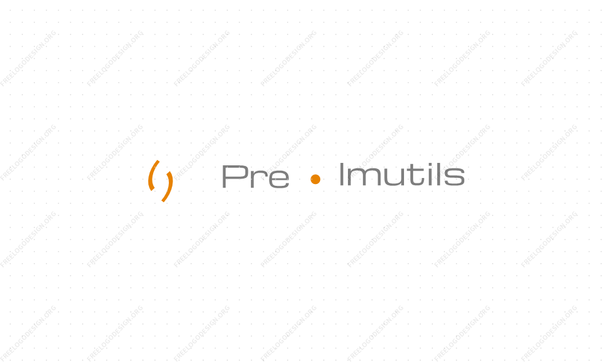

# Official English Documentation for PreImutils!


PreImutils is a python library built to empower developers, reseachers and students to prepare and preprocessing image datasets for applications and systems with Deep Learning and Computer Vision capabilities using simple and few lines of code. This documentation is provided to provide detailed insight into all the classes and functions available in PreImutils, coupled with a number of code examples.

The Official GitHub Repository of PreImutils is https://github.com/mrl-amrl/preimutils
## Easy to use:

## Why we need PreImutils?
Everything that you need to preprocess your image dataset is here.
One of the most important item for machine learning or CNN or other neural networks is preparing your dataset.

???+ note
    - It's easy to use:

    - You can use both in terminal and code
  
=== "Python"

```python
from preimutils import AMRLImageAug

img_aug = AMRLImageAug(json_path, xmls_dir, images_dir)
img_aug.auto_augmentation(quantity, resized = True, width = 300, height = 300)
```
=== "Bash"

```bash
JSON_PATH=~/YOUR_JSON_PATH/label.json
XMLS_DIR=~/YOUR_ANNOTATION_DIR/
IMAGES_DIR=~/YOUR_IMAGES_DIR/
FUNCTION=auto_augmentation
QUANTITY=1000 # the amount of each object to create

preimutils --function $FUNCTION --label_json_path $JSON_PATH --xmls_dir $XMLS_DIR --images_dir $IMAGES_DIR --quantity $QUANTITY
```

???+ SomePoint


    1.  The amount of your dataset is really important. Not very few that lose the accuracy not great number of that lose your time and cause to overfitting, more than 4000 image per object is enough that mostly. depend on how much your feature is hard.
    2.  The amount of each object image is important if objects sample count not equal your neural network forget the lower object count for instance if you have 3 object each one should have 4000 sample.


    3. Don't forget to shuffle your dataset if you don't do that you never ever don't get good accuracy on all of your objects.
    4. If you want to detect your object from all angles don't forget to put sample from other angle
   
!!! attention
        - **No**:
    

            | object   | Sample Count |
            | -------- | :----------: |
            | object 1 |     2000     |
            | object 2 |     1000     |
            | object 3 |     4000     |
        

        - **Yes**:


            | object   | Sample Count |
            | -------- | :----------: |
            | object 1 |     3900     |
            | object 2 |     4100     |
            | object 3 |     4000     |
    

**PreImutils** help you to do these points in few line of code. 

## How should I use the documentation?

If you are getting started with the library, you should follow the documentation in order by pressing the “Next” button at the bottom-right of every page.

You can also use the menu on the left to quickly skip over sections.


